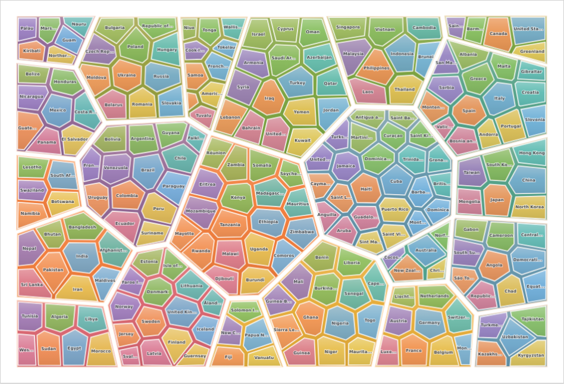
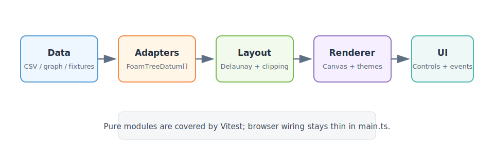
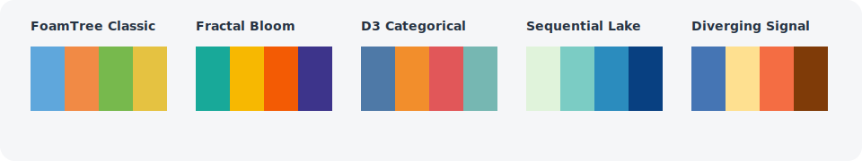

# A3 FoamTree

A3 FoamTree is a modern, TypeScript-first FoamTree-style hierarchical cluster browser. It uses Canvas for rendering and `d3-delaunay` for the geometric core, then layers in hierarchical layout, palette theming, labels, tooltips, drilldown, and extension hooks.

The project was built as a clean-room, modern-tech-stack exploration inspired by Carrot Search FoamTree behavior and interaction patterns. It does not ship the original FoamTree runtime.



## What It Does

- Renders hierarchical and flattened FoamTree-like Voronoi maps.
- Uses a remote world population CSV as the default dataset.
- Supports dataset switching, theme switching, custom theme JSON, and metric playback.
- Supports hover, select, double-click drilldown, breadcrumbs, escape-to-root, and long-press hooks.
- Provides render extension points for overlays and node badges.
- Ships with unit tests for parser, layout, geometry, hit testing, graph conversion, and themes.
- Includes developer and user documentation suitable for handoff.

## Quick Start

```bash
npm install
npm run dev
```

Open the Vite URL printed by the command, usually:

```text
http://localhost:5173/
```

## Requirements

- Node.js 22 or newer.
- npm 10 or newer.

The repo includes `.nvmrc`:

```bash
nvm use
```

## Scripts

```bash
npm run dev       # start local development server
npm run build     # TypeScript check and production build
npm run preview   # serve the production build
npm run test      # Vitest watch mode
npm run test:run  # one-shot unit tests
npm run check     # tests plus production build
```

## Architecture



The code is split so core behavior is testable without a browser:

```text
src/data/                    Dataset fixtures and CSV parser
src/foamtree/data/           Graph-to-hierarchy adapter
src/foamtree/extensions/     Render extension examples
src/foamtree/interaction/    Hit testing
src/foamtree/layout/         Polygon and Voronoi layout code
src/foamtree/render/         Canvas renderer and theme registry
src/main.ts                  App shell, controls, URL state, lifecycle
docs/                        User, developer, data, test, and release docs
```

Data flows through the system like this:

1. Data source returns `FoamTreeDatum[]`.
2. Layout turns bounds plus hierarchy into clipped polygons.
3. Renderer draws all cells, then draws labels in a second pass.
4. Interaction maps pointer events back to layout nodes.
5. App shell handles controls, URL state, breadcrumbs, and extension toggles.

## Default Dataset

The default dataset is fetched from Data-to-Viz:

```text
https://raw.githubusercontent.com/holtzy/data_to_viz/master/Example_dataset/11_SevCatOneNumNestedOneObsPerGroup.csv
```

The parser expects semicolon-separated fields:

```text
region;subregion;key;value
```

Rows become:

- Top-level groups: `region / subregion`
- Children: countries
- Display weight: `Math.max(1, Math.log10(value + 1))`
- Metrics: normalized population signals

The log display weight is intentional. Raw population values are too skewed for a readable FoamTree.

## Themes



Built-in themes:

- FoamTree Classic
- Fractal Bloom
- D3 Categorical
- Sequential Lake
- Diverging Signal

Users can also define a custom theme with JSON:

```json
{
  "label": "Custom",
  "categorical": ["#0ea5e9", "#f97316", "#22c55e"],
  "metric": {
    "low": "#f8fafc",
    "high": "#0f172a"
  }
}
```

## Interaction Model

| Action | Behavior |
| --- | --- |
| Hover | Shows tooltip and active readout |
| Click | Selects a cell |
| Double-click | Drills into a cell with children |
| Escape | Returns to the root view |
| Press and hold | Invokes the node detail hook |
| Metric playback | Steps through metric color modes |

## Testing

Run all fast checks:

```bash
npm run check
```

Current unit tests cover:

- CSV parsing and filtering.
- Graph conversion, missing nodes, and cycle detection.
- Polygon area, centroid, clipping, insetting, and point inclusion.
- Layout bounds and hierarchy-depth behavior.
- Hit testing with parent/child precedence.
- Theme color interpolation and custom theme validation.

## CI

GitHub Actions is configured in `.github/workflows/ci.yml`.

On push and pull request, CI runs:

```bash
npm ci
npm run check
```

## Pulling And Pushing

This repo includes small wrapper scripts:

```bash
./pull.sh
./push.sh
```

`pull.sh` fetches and fast-forwards the current branch from `origin`.

`push.sh` verifies the worktree is clean enough to push intentionally, then pushes the current branch to `origin`.

## Documentation

- [User Guide](docs/USER_GUIDE.md)
- [Developer Guide](docs/DEVELOPER_GUIDE.md)
- [Testing Guide](docs/TESTING.md)
- [Data and Themes](docs/DATA_AND_THEMES.md)
- [Production Checklist](docs/PRODUCTION_CHECKLIST.md)

## Production Notes

The app is ready for continued product development, but a public hosted release should decide:

- Whether to fetch the CSV live or ship a cached local copy.
- Whether recorded walkthrough assets should be release artifacts instead of repo files.
- How to handle remote data failures in the UI.
- Whether metric labels should be renamed for a population-focused product.
- Whether Playwright screenshot regression tests should gate theme changes.

## License

MIT. See [LICENSE](LICENSE).
